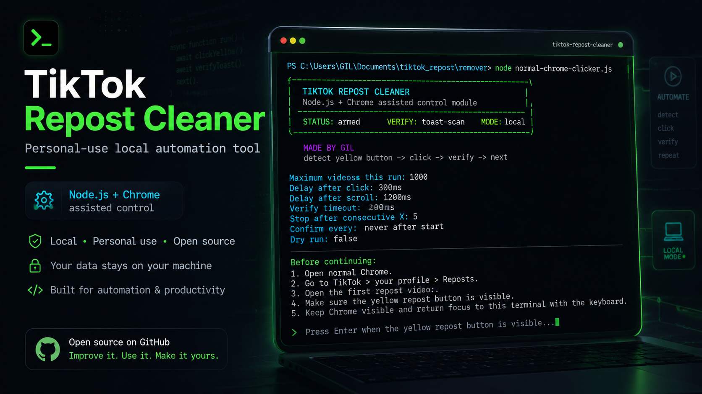

# TikTok Repost Cleaner

A small local tool that helps remove your own TikTok reposts from your normal
Chrome window.

It does not ask for your TikTok password, does not store cookies, does not use a
server, and does not use a database. You stay logged in through your own Chrome
browser. The tool only uses local screen detection plus Windows click/key
messages.

## Files

- `normal-chrome-clicker.js` - Node entry point and terminal UI.
- `normal-chrome-helper.ps1` - Windows helper for screen detection and local input.
- `package.json` - npm scripts only.
- `assets/cover.png` - GitHub README cover image.

## Run

```powershell
git clone https://github.com/Gilkol577/tiktok-repost-cleaner.git
cd tiktok-repost-cleaner
node normal-chrome-clicker.js
```

Then:

1. Open normal Chrome yourself.
2. Go to TikTok > profile > Reposts.
3. Open the first repost video.
4. Make sure the yellow repost button is visible.
5. Press Enter in the terminal.
6. Type `YES` when asked.

The tool scans the Chrome window for the yellow repost button before every
click, watches for TikTok's top confirmation banner, prints `V` when it sees the
banner and `X` when it does not, then presses ArrowDown to move to the next
video.

It stops automatically after 5 consecutive `X` results.

## Safety Controls

At the top of `normal-chrome-clicker.js`, change these constants as needed:

```js
const MAX_REPOSTS_TO_REMOVE = 1000;
const DELAY_MS = 300;
const AFTER_SCROLL_DELAY_MS = 1200;
const VERIFY_TIMEOUT_MS = 2000;
const STOP_AFTER_CONSECUTIVE_X = 5;
const DRY_RUN = false;
```

Set `DRY_RUN = true` to test detection without clicking.

## GitHub Safety

Do not commit browser profile folders, cookies, session folders, `node_modules`,
or temporary logs. This repo should only contain the source files and docs.

## Warning

TikTok can change its UI at any time, which can break detection. Stop the tool
if TikTok shows warnings, CAPTCHA, rate limits, or "try again later" messages.
